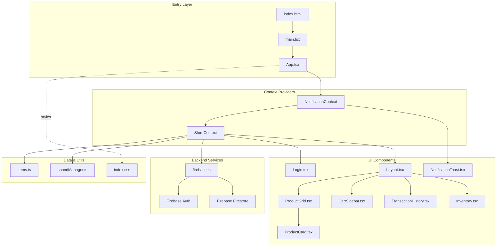
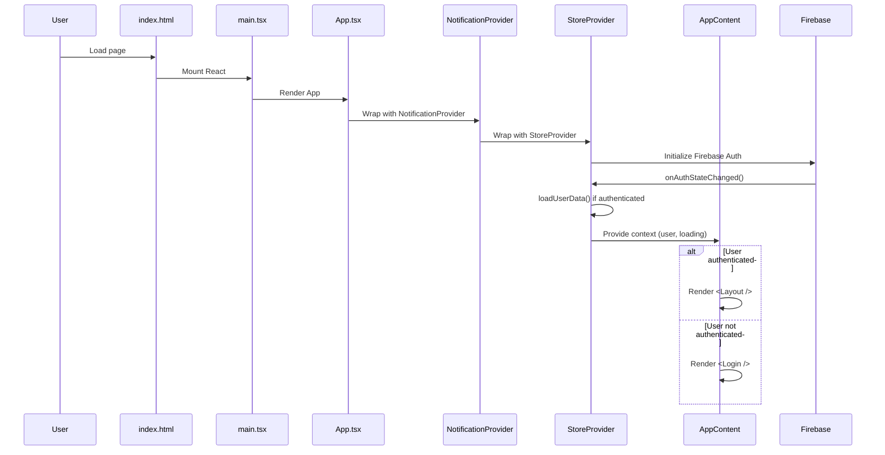
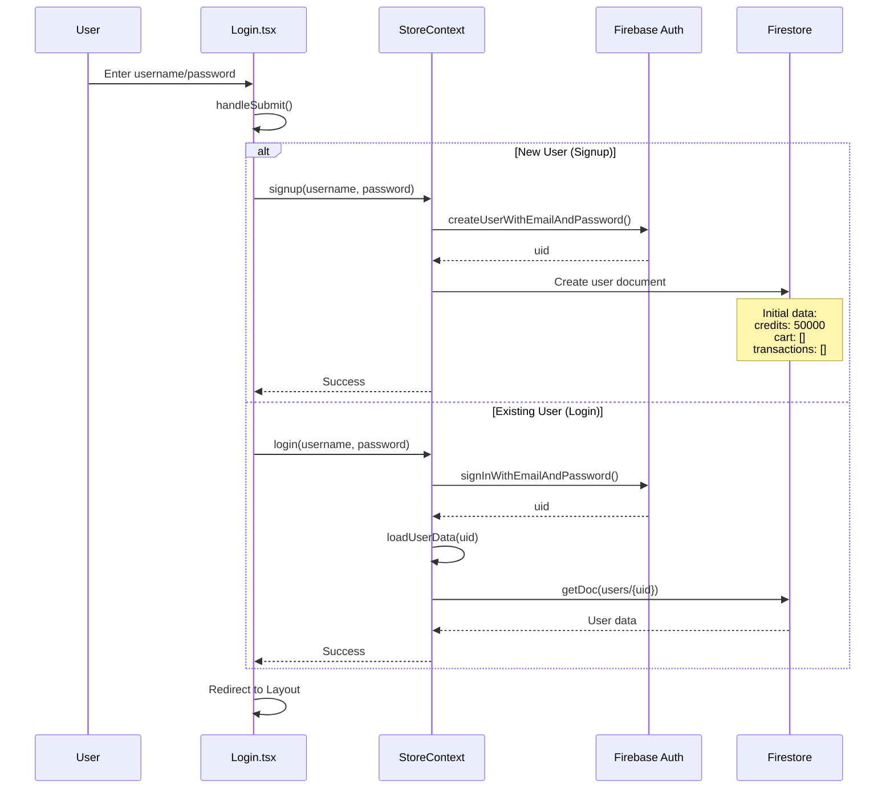
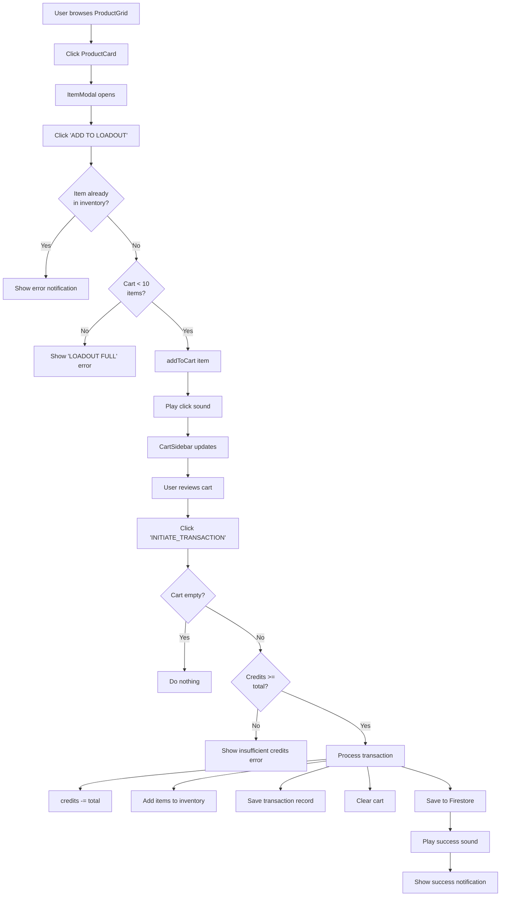
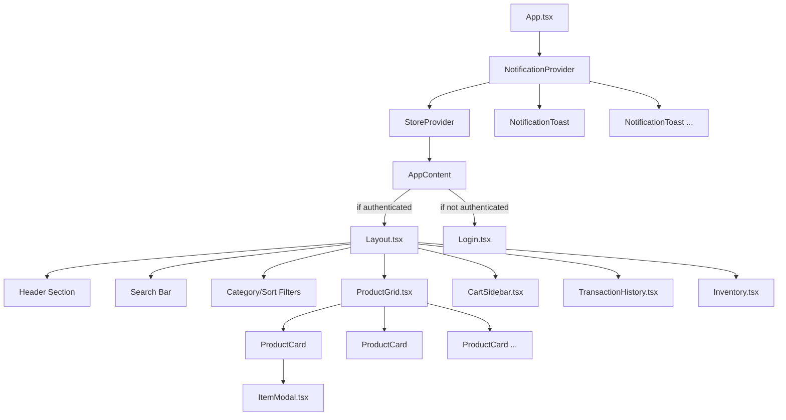
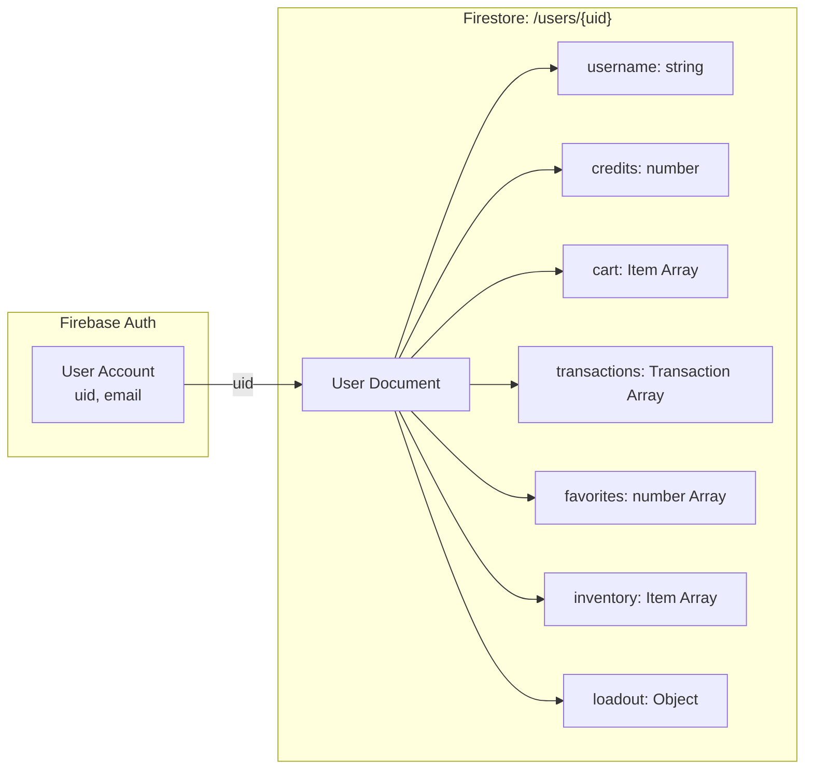
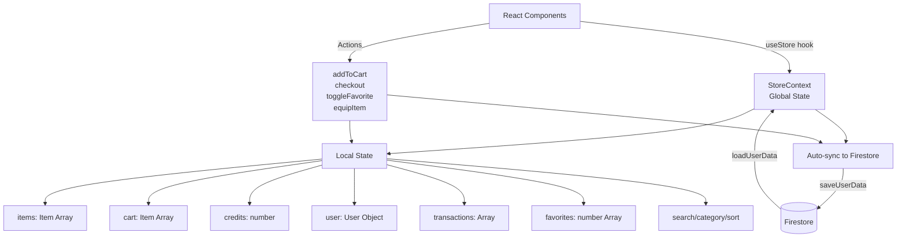
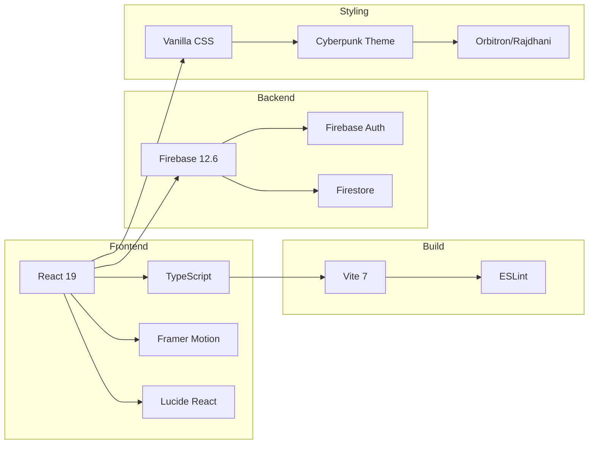
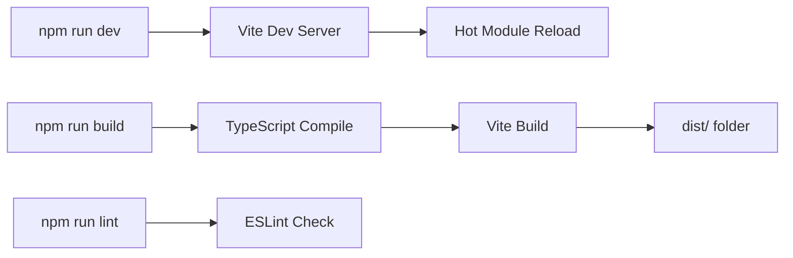

# CYBER_MARKET - Code Architecture Visualization

## Summary

- **Project**: CYBER_MARKET - A cyberpunk-themed in-game store prototype
- **Tech Stack**: React 19, TypeScript, Firebase (Auth + Firestore), Vite, Framer Motion
- **Architecture**: Context-based state management with global providers
- **Key Features**: User authentication, shopping cart system, transaction history, inventory management, favorites/wishlist
- **Entry Point**: User interacts through `Login.tsx` → authenticated users see `Layout.tsx` with product browsing and cart features

---

## 📐 High-Level Architecture



---

## 🔄 Application Boot Flow



---

## 🔐 Authentication Flow



---

## 🛒 Shopping & Checkout Flow



---

## 📦 Component Hierarchy



---

## 📂 Project File Structure

```
CYBER_MARKET/
├── index.html                    # Entry HTML
├── package.json                  # Dependencies (React, Firebase, Framer Motion)
├── vite.config.ts               # Vite build config
├── .env                         # Firebase credentials
│
├── src/
│   ├── main.tsx                 # React entry point
│   ├── App.tsx                  # Root component with providers
│   ├── App.css                  # App-specific styles
│   ├── index.css                # Global cyberpunk styles (16KB+)
│   │
│   ├── firebase.ts              # Firebase initialization
│   │
│   ├── components/              # UI Components
│   │   ├── Login.tsx           # Authentication screen
│   │   ├── Layout.tsx          # Main app layout
│   │   ├── ProductGrid.tsx     # Grid of all products
│   │   ├── ProductCard.tsx     # Individual product display
│   │   ├── ItemModal.tsx       # Product detail modal
│   │   ├── CartSidebar.tsx     # Shopping cart UI
│   │   ├── TransactionHistory.tsx
│   │   ├── Inventory.tsx       # User's owned items
│   │   └── NotificationToast.tsx
│   │
│   ├── context/                # State Management
│   │   ├── StoreContext.tsx    # Global store state (324 lines)
│   │   └── NotificationContext.tsx
│   │
│   ├── data/
│   │   └── items.ts            # Product catalog (8 items)
│   │
│   └── utils/
│       └── soundManager.ts     # Audio playback system
│
└── dist/                        # Production build output
```

---

## 🔑 Key Data Flows

### Firebase Data Structure



### State Management Pattern



---

## 🎯 Critical Entry Points

### User Actions & Hooks

| User Action | Entry Point | Flow |
|-------------|-------------|------|
| **Page Load** | `main.tsx` → `App.tsx` | Initialize providers → Check auth → Show Login/Layout |
| **Login/Signup** | `Login.tsx` → `handleSubmit()` | Validate → Firebase Auth → Load user data → Show Layout |
| **Browse Products** | `Layout.tsx` → `ProductGrid.tsx` | Render `filteredItems` from StoreContext |
| **Add to Cart** | `ProductCard.tsx` → `addToCart()` | Validate → Update cart state → Save to Firestore |
| **Checkout** | `CartSidebar.tsx` → `checkout()` | Validate credits → Deduct → Move to inventory → Clear cart → Save |
| **Toggle Favorite** | `ProductCard.tsx` → `toggleFavorite()` | Add/remove ID from favorites array → Save |
| **View History** | `Layout.tsx` → `TransactionHistory.tsx` | Display transactions from StoreContext |
| **View Inventory** | `Layout.tsx` → `Inventory.tsx` | Display inventory items → Equip to loadout slots |

---

## 🎨 Key Technologies



---

## 🔍 Key Observations

### Entry Points
- **Main entry**: `main.tsx` renders `App.tsx` into `#root`
- **Authentication gate**: `AppContent` component checks `user` state to show `Login` or `Layout`
- **User interactions**: All product interactions flow through `StoreContext` methods

### Data Sources
- **Static catalog**: `items.ts` contains 8 predefined items (weapons, implants, gear)
- **User data**: Loaded from Firestore `/users/{uid}` on authentication
- **Real-time sync**: All cart, inventory, and transaction changes auto-save to Firestore via `saveUserData()`

### Side Effects
- **Firebase writes**: Triggered by `checkout()`, `addToCart()`, `toggleFavorite()`, `equipItem()`, `unequipItem()`
- **Audio playback**: `soundManager.ts` plays click/hover/success/error sounds
- **Notifications**: `NotificationContext` displays toast messages for 3 seconds

### UI Updates & State Flow
- **Context consumers**: Components use `useStore()` hook to access global state
- **Filtered display**: `ProductGrid` shows `filteredItems` based on search/category/sort
- **Cart updates**: `CartSidebar` displays real-time cart contents and calculated total
- **Animations**: Framer Motion handles enter/exit animations for cards, modals, toasts

### Missing Context
- **Legacy code**: `_legacy` folder contains old JavaScript files (not currently used)
- **Sound files**: Sound manager references audio URLs (not visible in file structure)
- **Environment variables**: `.env` contains Firebase credentials (not shown for security)
- **Build output**: `dist/` folder contains production bundle

---

## 📝 Notes for Other Agents

**Architect**: 
- State management is centralized in `StoreContext.tsx` (324 lines) - consider splitting if adding more features
- Firebase operations in same file as React context - could separate into service layer
- No routing library used (single-page app with conditional rendering)

**Implementer**: 
- When modifying authentication: Start from `Login.tsx` → `StoreContext.login()/signup()`
- When adding new products: Update `data/items.ts`
- When adding features: Add methods to `StoreContext` and expose via context value
- All Firebase operations use async/await pattern

**Refactorer**: 
- `StoreContext.tsx` handles both state management AND Firebase operations - could separate concerns
- `Layout.tsx` manages multiple modals/sidebars - could extract state management
- Inline styles in some components (`Login.tsx`, `CartSidebar.tsx`) - could move to CSS

**Verifier**: 
- Critical paths for tests:
  1. Auth flow: `Login → signup → Firestore write → user state update`
  2. Purchase flow: `ProductCard → addToCart → checkout → inventory update → Firestore sync`
  3. Favorites: `ProductCard → toggleFavorite → Firestore sync`
- Firebase operations depend on `.env` configuration
- No test files currently in project

---

## 🚀 Development Workflow



**Commands**:
- `npm run dev` - Start development server with HMR
- `npm run build` - TypeScript compile → Vite production build
- `npm run lint` - Run ESLint on all files
- `npm run preview` - Preview production build locally
