# CYBER_MARKET - Component-by-Component Visualization

Detailed breakdown of each component showing internal logic, state management, data flows, and interactions.

---

## 📋 Table of Contents

1. [Login.tsx](#logintsx)
2. [Layout.tsx](#layouttsx)
3. [ProductGrid.tsx](#productgridtsx)
4. [ProductCard.tsx](#productcardtsx)
5. [ItemModal.tsx](#itemmodaltsx)
6. [CartSidebar.tsx](#cartsidebartsx)
7. [TransactionHistory.tsx](#transactionhistorytsx)
8. [Inventory.tsx](#inventorytsx)
9. [NotificationToast.tsx](#notificationtoasttsx)
10. [StoreContext.tsx](#storecontexttsx)
11. [NotificationContext.tsx](#notificationcontexttsx)
12. [soundManager.ts](#soundmanagerts)

---

## 🔐 Login.tsx

**Purpose**: Authentication screen for user login and signup

### Component Flow


### Internal State

| State Variable | Type | Purpose |
|----------------|------|---------|
| `isLogin` | boolean | Toggle between login/signup mode |
| `username` | string | User input for username |
| `password` | string | User input for password |
| `error` | string | Client-side validation errors |

### Data Flow


### Key Functions

**`handleSubmit(e)`**
- Prevents default form submission
- Validates username and password not empty
- Calls `login()` or `signup()` based on `isLogin` state
- Shows notification with result

---

## 🎨 Layout.tsx

**Purpose**: Main application layout with header, navigation, and content area

### Component Structure


### Local State Management

| State | Type | Purpose |
|-------|------|---------|
| `showHistory` | boolean | Toggle transaction history modal |
| `showInventory` | boolean | Toggle inventory modal |
| `showCart` | boolean | Toggle cart sidebar (mobile) |

### User Interactions


---

## 🔲 ProductGrid.tsx

**Purpose**: Display grid of filtered product cards

### Component Logic


### Internal State

- `selectedItem`: Item | null - Currently selected item for modal display

### Data Flow


---

## 🎴 ProductCard.tsx

**Purpose**: Display individual product with image, stats, price, and actions

### Component Flow


### Event Handlers

**`handleBuy(e)`**
- Stops event propagation (prevents card click)
- Plays click sound
- Calls `addToCart(item)`

**`handleFavorite(e)`**
- Stops event propagation
- Calls `toggleFavorite(item.id)`

**Card Click**
- Calls `onSelect(item)` to show modal

**Hover**
- Plays hover sound
- Scales card to 1.02x (Framer Motion)

### Styling Classes

- Base: `.product-card`
- Rarity-specific: `.rarity-legendary`, `.rarity-epic`, `.rarity-rare`, `.rarity-common`
- Each rarity has unique border glow effect

---

## 🪟 ItemModal.tsx

**Purpose**: Full-screen modal showing detailed product information

### Component Structure


### User Interaction


---

## 🛒 CartSidebar.tsx

**Purpose**: Shopping cart display with checkout functionality

### Component Flow


### Props

- `isOpen`: boolean - Control visibility (mobile)
- `onClose`: () => void - Close handler (mobile)

### Cart Item Display

Each item shows:
- Item name
- Price (¥)
- Remove button (X icon)

### Total Calculation

```javascript
const total = cart.reduce((sum, item) => sum + item.price, 0);
```

---

## 📜 TransactionHistory.tsx

**Purpose**: Modal displaying all past transactions

### Component Structure


### Transaction Display Format

```
┌─────────────────────────────────────┐
│ 11/26/2025, 12:00:00 PM    ¥ 12,500 │
│ M-179 ACHILLES                      │
└─────────────────────────────────────┘
```

### Data Source

- Reads `transactions` from StoreContext
- Each transaction has:
  - `id`: string
  - `timestamp`: number
  - `total`: number
  - `items`: Item[]

---

## 🎒 Inventory.tsx

**Purpose**: Dual-panel inventory management with loadout system

### Component Layout


### Equipment Slots

| Slot | Type | Icon | Purpose |
|------|------|------|---------|
| `primary` | weapon | Crosshair | Main weapon |
| `secondary` | weapon | Crosshair | Backup weapon |
| `armor` | gear | Shield | Body armor |
| `implant` | implant | Cpu | Neural implant |
| `gear` | gear | Box | Tactical equipment |

### Equipment Logic Flow


### Unequip Flow


---

## 🔔 NotificationToast.tsx

**Purpose**: Animated toast notification with type-specific styling

### Notification Types


### Styling Config

| Type | Color | Background | Icon |
|------|-------|------------|------|
| success | #00ff00 | rgba(0, 20, 0, 0.9) | CheckCircle |
| error | #ff0055 | rgba(20, 0, 5, 0.9) | AlertTriangle |
| info | #00f3ff | rgba(0, 20, 40, 0.9) | Info |

### Animation Lifecycle


### Framer Motion Config

```javascript
initial: { x: 100, opacity: 0 }
animate: { x: 0, opacity: 1 }
exit: { x: 100, opacity: 0, scale: 0.9 }
transition: { type: 'spring', stiffness: 300, damping: 25 }
```

---

## 🏪 StoreContext.tsx

**Purpose**: Global state management for the entire application

### State Architecture

```mermaid
graph TD
    StoreContext[StoreContext Provider] --> AppState[Application State]
    
    AppState --> UserState[User State]
    AppState --> CartState[Cart State]
    AppState --> ItemState[Item State]
    AppState --> UIState[UI State]
    
    UserState --> User[user: User | null]
    UserState --> Loading[loading: boolean]
    UserState --> Credits[credits: number]
    UserState --> Inventory[inventory: Item Array]
    UserState --> Loadout[loadout: Loadout Object]
    UserState --> Transactions[transactions: Array]
    UserState --> Favorites[favorites: number Array]
    
    CartState --> Cart[cart: Item Array]
    
    ItemState --> Items[items: Item Array]
    ItemState --> FilteredItems[filteredItems: Item Array]
    
    UIState --> Search[searchQuery: string]
    UIState --> Category[selectedCategory: string]
    UIState --> Sort[sortBy: string]
```

### Key Functions Overview


### Firebase Integration Flow


### Checkout Logic

```mermaid
graph TD
    Start[checkout called] --> CheckEmpty{cart.length > 0?}
    CheckEmpty -->|No| ReturnFail[Return: error message]
    
    CheckEmpty -->|Yes| CheckCredits{credits >= total?}
    CheckCredits -->|No| ReturnInsufficient[Return: insufficient credits]
    
    CheckCredits -->|Yes| Process[Process Transaction]
    Process --> DeductCredits[credits -= total]
    Process --> MoveToInventory[cart items → inventory]
    Process --> CreateTransaction[Create transaction record]
    Process --> ClearCart[cart = empty array]
    
    Process --> Save[saveUserData to Firestore]
    Save --> PlaySound[soundManager.playPurchase]
    PlaySound --> ReturnSuccess[Return: success message]
```



### Item Filtering Logic

```mermaid
graph TD
    AllItems[items from items.ts] --> SearchFilter{searchQuery?}
    SearchFilter -->|Yes| NameMatch[Filter by name match]
    SearchFilter -->|No| CategoryFilter
    
    NameMatch --> CategoryFilter{selectedCategory?}
    CategoryFilter -->|all| SortStep
    CategoryFilter -->|specific| TypeMatch[Filter by item.type]
    
    TypeMatch --> SortStep{sortBy?}
    SortStep -->|""| ReturnFiltered[Return filteredItems]
    SortStep -->|price-asc| SortPriceAsc[Sort by price ascending]
    SortStep -->|price-desc| SortPriceDesc[Sort by price descending]
    SortStep -->|name| SortName[Sort alphabetically]
    
    SortPriceAsc --> ReturnFiltered
    SortPriceDesc --> ReturnFiltered
    SortName --> ReturnFiltered
```

---

## 🔔 NotificationContext.tsx

**Purpose**: Manage global notification toast system

### Context Architecture

```mermaid
graph TD
    NotifCtx[NotificationContext] --> State[notifications array]
    NotifCtx --> Method[showNotification method]
    
    Method --> CreateNotif[Create notification object]
    CreateNotif --> AddToArray[Add to notifications]
    AddToArray --> SetTimeout[setTimeout 3000ms]
    SetTimeout --> AutoRemove[Remove from array]
    
    State --> Render[Render NotificationToast components]
    Render --> Toast1[Toast 1]
    Render --> Toast2[Toast 2]
```

### Notification Lifecycle

```mermaid
sequenceDiagram
    participant Component
    participant Context as NotificationContext
    participant State
    participant Toast as NotificationToast
    
    Component->>Context: showNotification(message, type)
    Context->>Context: Generate unique ID
    Context->>State: Add to notifications array
    State->>Toast: Render new toast
    
    Note over Context: Wait 3 seconds
    Context->>State: Remove notification by ID
    State->>Toast: AnimatePresence exit
    Toast->>Toast: Slide out animation
```

### Usage Pattern

```typescript
const { showNotification } = useNotification();

// Success
showNotification('Transaction completed!', 'success');

// Error
showNotification('Insufficient credits', 'error');

// Info
showNotification('Item added to cart', 'info');
```

---

## 🎵 soundManager.ts

**Purpose**: Web Audio API sound effect system

### Sound Manager Architecture

```mermaid
graph TD
    SoundManager[SoundManager Class] --> AudioCtx[AudioContext]
    SoundManager --> Methods[Sound Methods]
    SoundManager --> State[enabled: boolean]
    
    Methods --> PlayClick[playClick 800Hz 0.05s]
    Methods --> PlayHover[playHover 600Hz 0.03s]
    Methods --> PlayPurchase[playPurchase multi-tone]
    Methods --> PlayError[playError descending]
    Methods --> ToggleMute[toggleMute]
    
    PlayClick --> CreateBeep[createBeep]
    PlayHover --> CreateBeep
    
    PlayPurchase --> Beep1[450Hz 0.1s]
    PlayPurchase --> Beep2[550Hz 0.1s delay 80ms]
    PlayPurchase --> Beep3[650Hz 0.15s delay 160ms]
    
    PlayError --> ErrorBeep1[200Hz 0.15s]
    PlayError --> ErrorBeep2[150Hz 0.2s delay 100ms]
```

### Sound Specifications

| Sound | Frequency | Duration | Volume | Description |
|-------|-----------|----------|--------|-------------|
| Click | 800 Hz | 50ms | 0.05 | UI button clicks |
| Hover | 600 Hz | 30ms | 0.03 | Card hover effects |
| Purchase | 450→550→650 Hz | 250ms total | 0.06 | Checkout success |
| Error | 200→150 Hz | 300ms total | 0.08 | Failed actions |

### Web Audio Implementation

```mermaid
sequenceDiagram
    participant Call as Function Call
    participant Manager as SoundManager
    participant Web as Web Audio API
    
    Call->>Manager: playClick()
    Manager->>Manager: Check if enabled
    Manager->>Web: createOscillator()
    Manager->>Web: createGain()
    Web->>Web: Connect nodes
    Web->>Web: Set frequency & type
    Web->>Web: Exponential ramp gain
    Web->>Web: start() → stop()
    Note over Web: Sound plays for duration
```

### Usage in Components

```typescript
import { soundManager } from '../utils/soundManager';

// On button click
soundManager.playClick();

// On card hover
soundManager.playHover();

// On successful purchase
soundManager.playPurchase();

// On error
soundManager.playError();

// Toggle mute
soundManager.toggleMute();
```

---

## 🔄 Cross-Component Data Flow Summary

### Complete User Journey: Browse → Add to Cart → Checkout

```mermaid
sequenceDiagram
    participant User
    participant Layout
    participant Grid as ProductGrid
    participant Card as ProductCard
    participant Modal as ItemModal
    participant Cart as CartSidebar
    participant Store as StoreContext
    participant Sound as soundManager
    participant Notif as NotificationContext
    participant Firebase as Firestore
    
    User->>Layout: Browse products
    Layout->>Grid: Render filtered items
    Grid->>Card: Display product cards
    
    User->>Card: Hover over card
    Card->>Sound: playHover()
    
    User->>Card: Click card
    Card->>Modal: Show item details
    
    User->>Modal: Click PURCHASE
    Modal->>Sound: playClick()
    Modal->>Store: addToCart(item)
    
    Store->>Store: Validate (not in inventory)
    Store->>Store: Validate (cart < 10)
    Store->>Store: Add to cart array
    Store->>Firebase: saveUserData()
    
    Modal->>Modal: Close modal
    Cart->>Cart: Update cart display
    
    User->>Cart: Click INITIATE_TRANSACTION
    Cart->>Store: checkout()
    
    Store->>Store: Validate cart not empty
    Store->>Store: Validate credits >= total
    Store->>Store: Deduct credits
    Store->>Store: Move items to inventory
    Store->>Store: Create transaction record
    Store->>Store: Clear cart
    Store->>Firebase: saveUserData()
    
    Store->>Sound: playPurchase()
    Store->>Notif: showNotification(success)
    
    Notif->>User: Display success toast
    Cart->>Cart: Close sidebar
```

---

## 📊 State Management Patterns

### Context Provider Hierarchy

```
App
├── NotificationProvider (outer)
│   └── StoreProvider (inner)
│       └── AppContent
│           ├── Login (if not authenticated)
│           └── Layout (if authenticated)
│               └── All child components
```

### Hook Usage Pattern

```typescript
// In any component
import { useStore } from '../context/StoreContext';
import { useNotification } from '../context/NotificationContext';

const MyComponent = () => {
    const { user, cart, addToCart, credits } = useStore();
    const { showNotification } = useNotification();
    
    // Use context values and methods
};
```

---

## 🎭 Animation Patterns

### Framer Motion Usage Across Components

| Component | Animation | Purpose |
|-----------|-----------|---------|
| ProductCard | `whileHover={{ scale: 1.02 }}` | Highlight on hover |
| ProductCard | `initial={{ opacity: 0, y: 20 }}` | Fade in from below |
| ItemModal | `initial={{ scale: 0.9 }}` | Zoom in modal |
| NotificationToast | `initial={{ x: 100 }}` | Slide in from right |
| CartSidebar | `initial={{ x: 20 }}` | Slide cart items in |
| Inventory | `whileHover={{ scale: 1.05 }}` | Item card hover |

### AnimatePresence Wrapping

Used for exit animations on:
- NotificationToast (auto-dismiss)
- ItemModal (close modal)
- TransactionHistory (close modal)
- Inventory (close modal)
- Cart items (remove from cart)

---

## 🔗 Component Dependencies Graph

```mermaid
graph TB
    App[App.tsx] --> NotifCtx[NotificationContext]
    App --> StoreCtx[StoreContext]
    
    StoreCtx --> Firebase[firebase.ts]
    StoreCtx --> Items[data/items.ts]
    StoreCtx --> Sound[utils/soundManager.ts]
    
    NotifCtx --> Toast[NotificationToast.tsx]
    
    StoreCtx --> Layout[Layout.tsx]
    StoreCtx --> Login[Login.tsx]
    
    Layout --> Grid[ProductGrid.tsx]
    Layout --> Cart[CartSidebar.tsx]
    Layout --> History[TransactionHistory.tsx]
    Layout --> Inventory[Inventory.tsx]
    
    Grid --> Card[ProductCard.tsx]
    Grid --> Modal[ItemModal.tsx]
    
    Card --> Sound
    Modal --> StoreCtx
    Cart --> StoreCtx
    Cart --> NotifCtx
    
    Firebase --> AuthAPI[Firebase Auth]
    Firebase --> FirestoreAPI[Firestore]
```

---

## 🎯 Critical Interaction Points

### Where Components Talk to StoreContext

| Component | Methods Used | Data Read |
|-----------|-------------|-----------|
| Login | `login()`, `signup()` | `user`, `loading` |
| Layout | `logout()`, `setSearchQuery()`, `setSelectedCategory()`, `setSortBy()` | `credits`, `user`, `searchQuery`, `selectedCategory` |
| ProductGrid | - | `filteredItems` |
| ProductCard | `addToCart()`, `toggleFavorite()` | `favorites` |
| ItemModal | `addToCart()` | - |
| CartSidebar | `removeFromCart()`, `checkout()` | `cart` |
| TransactionHistory | - | `transactions` |
| Inventory | `equipItem()`, `unequipItem()` | `user.inventory`, `user.loadout` |

---

## 🚀 Performance Considerations

### Optimization Patterns

1. **Memoization Opportunities**
   - `filteredItems` could use `useMemo` for expensive filtering
   - Stats calculations in Inventory could be memoized

2. **Re-render Triggers**
   - Every StoreContext update re-renders ALL consumers
   - Consider splitting context into smaller pieces for large apps

3. **Firebase Optimization**
   - `saveUserData()` called on EVERY cart/inventory change
   - Could implement debouncing for frequent updates

4. **Animation Performance**
   - Framer Motion animations use GPU acceleration
   - Large grids might benefit from virtualization

---

## 📝 Summary

This cyberpunk store uses a **centralized state management pattern** with React Context, **real-time Firebase synchronization**, and **rich animations** via Framer Motion. Key design patterns include:

- Single source of truth (StoreContext)
- Optimistic UI updates with Firebase sync
- Sound effect feedback for all interactions
- Toast notifications for user feedback
- Modular component architecture with clear responsibilities
